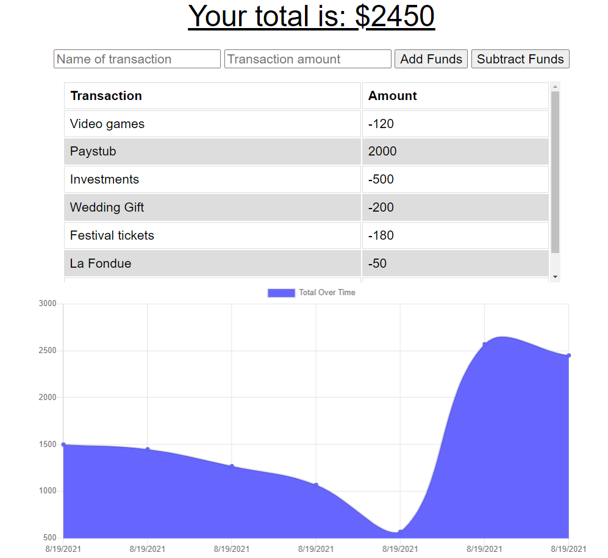

# Progressive Budget Tracker

As a progressive web application, keep track of your spending online and offline on your desktop or mobile device.  

## Table of contents
* [Description](#description)
* [Installation](#installation)
* [Usage and links](#usage)
* [License](#license)
* [Contributors](#contributors)
* [Tests](#tests)
* [Questions](#questions)

## Description

Utilizing chartjs and pertinent offline and online scripts, keep track of spending habits and income.

Offline functionality includes entering deposits and expenses while not connected to the server.  When brought back online, all pending transactions will be added to the server database.

Screenshots:

<h4> Home Screen </h4>

## Installation

This application is run via `Node.js` and `Express`.

NPM packages required (`npm i` to install all the packages):

Packages used:
<ul>
<li><a href="https://www.npmjs.com/package/express">Express</a></li>
<li><a href="https://www.npmjs.com/package/mongoose">Mongoose</a></li>
<li><a href="https://www.npmjs.com/package/morgan">Morgan</a></li>
<li><a href="https://www.npmjs.com/package/lite-server">lite-server</a></li>
<li><a href="https://www.npmjs.com/package/compression">compression</a></li>
</ul>

Optional: 
[nodemon](https://www.npmjs.com/package/nodemon)

Run `node server.js` to start the server.  

## Usage

<h4> A video demonstration </h4>

Enter the name of the transactions and their amounts.  Click add funds or subtract funds to record into the database.

Deployed application: [click here.](https://prog-budget-jtn.herokuapp.com/)

Github repository: [click here.](https://github.com/NguyenJohnnyT/budget_tracker)

## License

This application is licensed under [MIT]((https://opensource.org/licenses/MIT)).

## Contributors

Anyone can contribute to this project.

## Tests

No tests available.

## Questions
Have a question? Please email me at johnnytrucnguyen@gmail.com

[My Github](https://www.github.com/nguyenjohnnyt)